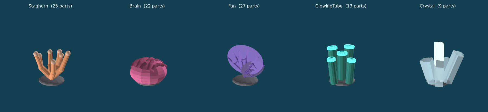

# Reef Keepers (working title)

A cozy co-op Roblox game: grow a living coral reef, attract rare sea creatures, and visit your friends' reefs.

- **Design plan:** [`docs/DESIGN.md`](docs/DESIGN.md): vision, core loop, economy, monetization, live ops, launch plan, metrics, and risks.
- **Prototype:** the "one-coral prototype" from the plan's next steps, as a [Rojo](https://rojo.space) project.
- **Economy simulator:** [`tools/economy_sim.py`](tools/economy_sim.py), which plays through days 1, 7, and 30 against the same balance file the game uses.

## Run the game

1. Install [Roblox Studio](https://create.roblox.com/) and Rojo (`aftman install` uses the pinned version in `aftman.toml`, or install the Rojo Studio plugin plus CLI yourself).
2. Build a place file and open it:
   ```sh
   rojo build -o ReefKeepers.rbxl
   ```
   Or run `rojo serve` and connect from the Rojo plugin in Studio for live sync.
3. Press Play. You spawn next to your plot with one Staghorn coral already growing and 20 pearls.
4. Tap an empty sand slot to plant the selected coral, tap a coral marked **Ready!** to harvest, and tap the yellow pad to buy a slot.

Saves work in Studio only when **Game Settings → Security → Enable Studio Access to API Services** is on. Otherwise the game runs with in-memory saves and prints a warning.

## Core architecture

| Plan item | Where |
|---|---|
| Reef plot with 6 starting slots, expandable to 40, each slot 1.5× the last | `src/server/ReefService.luau`, `ReefMath.slotCost` |
| Corals on real-time timers, computed from the planted timestamp (offline growth included, capped at 8 h) | `src/shared/ReefMath.luau` |
| All balance values in one place, editable without code changes | `src/shared/Balance.json` |
| Server-authoritative currency and growth; the client only renders attributes | `ReefService.onSlotClicked`, `onBuySlot` |
| Validated, rate-limited requests (ownership, reach distance, token bucket) | `ReefService.luau` (`allow`, `inReach`, `onSelectCoral`) |
| DataStore saving with retries, session locking, autosave, save on leave and shutdown | `src/server/PlayerStore.luau` |
| Analytics: onboarding funnel and pearl sources/sinks | `logOnboarding`, `logPearls` in `ReefService.luau` |
| Phone first: big buttons, safe-area HUD, content streaming, one timer loop at 4 Hz | `src/client/init.client.luau`, `default.project.json` |
| Return hook: HUD always shows the next coral to mature | client timer loop |

## Visuals and effects

Everything is built from parts and Roblox's built-in effects in code, so there is nothing to upload. Decoration is created on each client and never replicated, which keeps server and network costs low.



| What | Where |
|---|---|
| A distinct model for each coral, 9 to 27 parts each, that grows from a small fragment to full size over its first cycle | `src/shared/CoralModels.luau`, `src/client/CoralRenderer.luau` |
| A sparkle on ready corals; a pearl burst, flying pearls, a floating "+N", and a sound on harvest; a sand puff on planting; new slots rising out of the sand | `src/client/Effects.luau` |
| Fish that circle each reef, one more for every 2 corals (up to 10), plus a school at spawn | `src/client/Fish.luau` |
| A coral garden at spawn, rocks, swaying kelp, flickering sunbeams, bubble vents, drifting plankton, and a water surface | `src/client/WorldDecor.luau` |
| Underwater lighting: atmosphere haze, bloom, color tint, sun rays | `Lighting` in `default.project.json` |
| Sand plots with rock borders and name signs, round sand slots, a glowing gold buy pad | `buildPlot` / `createSlot` in `ReefService.luau` |

Sounds use built-in Roblox placeholder sounds (`SOUNDS` in `Effects.luau`). Swap in your own uploaded audio IDs there.

To preview coral shapes without Studio, run `python3 tools/preview/render_corals.py`. It runs the real `CoralModels.luau` in the `luau` CLI against a small mock of Roblox's math types and writes `docs/coral_preview.png`. It needs matplotlib.

## Game systems

Everything in the design doc's launch scope and Updates 2 and 3 is built. All tuning values are in `src/shared/Balance.json`.

| System | How it works | Code |
|---|---|---|
| Rotating rare shop | Fan Coral is in stock about 60% of 30-minute periods. The stock is derived from the clock, so every server agrees | `src/shared/ShopRotation.luau` |
| Reef health | 0–100 score from coral variety, how full the plot is, and care (harvesting before the 8 h cap). Tiers Struggling / Healthy / Thriving pay x1.0 / x1.1 / x1.25 | `src/shared/ReefHealth.luau` |
| Creatures | 30 creatures in 10 body types, each with conditions (coral counts, total corals, variety, health). Tap a visitor to feed it for Shells and Pearls. Rare ones can drop a Glowing Tube coral | `CreatureService.luau`, `CreatureRules.luau`, `CreatureModels.luau`, `CreatureRenderer.luau` |
| Shells and inventory | Second currency, and saved corals you plant for free (creature drops, prestige shop, project rewards, purchases) | `ReefService.addCurrency` / `addInventory` |
| Collection book | 4 pages (corals plus 3 pages of creatures) with hints for missing entries; a finished page pays Shells | `BookService.luau`, `src/client/Book.luau` |
| Tide Reset | Reset at 31 slots (+1 per later reset) for +x0.25 income forever and a Crystal Coral. The prestige shop sells corals for Shells | `PrestigeService.luau` |
| Daily goals and streak | 3 goals per UTC day picked from templates, plus a login streak bonus | `DailyService.luau` |
| Reef visits | Visit any reef on the server; visitor and host both get a capped daily pearl bonus. Visitors can feed the host's creatures | `SocialService.luau` |
| Friend boost | +5% income per friend on the same server, up to 3 friends | `SocialService.luau` |
| Leaderboards | Leaderboard area off the ring road with all-time Most Rebirths, Most Shells, and Most Pearls boards; Shells and Rebirths also in the player list | `LeaderboardService.luau` |
| Friend join bonus | A friend joining your server pays you both 100 pearls and 10 shells, once per friend | `SocialService.luau` |
| Likes and Top Reefs | Like a reef once a day; a weekly board at spawn lists the most-liked reefs | `SocialService.luau` |
| Trading | Trade inventory corals with two steps (Ready, then Confirm), a value summary on both sides, Robux-bought corals locked, a 3-day account age minimum, and a daily cap | `TradeService.luau` |
| Group reef projects | Server-wide goals (plant, feed, or harvest together); contributors get Shells and a coral | `GroupProjectService.luau` |
| Photo mode | Hides all UI, 4 camera angles plus orbit, saves to the device gallery | `src/client/PhotoMode.luau` |
| Monetization | 4 gamepasses, speed-up packs, a Rare Coral Bundle, and a rewarded ad. See below | `MonetizationService.luau` |

### Second wave of features

| Feature | How it works | Code |
|---|---|---|
| Reef level and XP | Harvesting, planting, and feeding give XP. Levels unlock decorations (7, placed behind your reef), free plot slots, deep zones, corals, and Shells. Tap the level badge to see the next reward | `LevelService.luau`, `ReefLevel.luau`, `DecorModels.luau` |
| Nametags | Everyone's overhead tag shows reef level, Tide (prestige) badge, and VIP | `Nametags.luau` |
| 7-day login streak | A different reward each day with a big day-7 prize (Glowing Tube Coral + 100 shells); popup on login and a calendar in Goals | `DailyService.luau` |
| Rare Coral Today | One rare coral a day in the Shop, bought once with Shells. The rotating Fan market now restocks every 10 minutes | `ShopRotation.daily` |
| Coral quests | Daily goals now include "Harvest 15 Staghorn corals", mutations, passing visitors, and level-ups (4 goals a day) | `Balance.json > daily.templates` |
| Mutated corals | A new coral may grow Glowing (x2 pearls, 3%), Rainbow (x3, 1%), or Crystalline (x5, 0.4%), each with its own look | `ReefService.rollMutation`, `CoralRenderer.luau` |
| Reef events | Every 12–20 minutes: Coral Bloom (2x growth), Night Glow (reef lights up, 2x mutation odds), or Storm (a treasure chest washes up on every reef) | `EventService.luau`, `EventFX.luau` |
| Creatures that matter | 12 creatures boost your reef while visiting: e.g. Clownfish makes Staghorn grow 25% faster, Whale Shark gives +25% pearls, Glow Jelly doubles mutation odds | `Balance.json > creatures.*.boost` |
| Passing visitors | A Dolphin, Wandering Turtle, or Giant Manta swims across your reef every few minutes; tap it for a gift | `CreatureService.luau` (passers) |
| Pet companions | Any swimming creature you've found can follow you; pick it in the Book. Everyone sees everyone's pets | `PetRenderer.luau` |
| Book silhouettes | Book cards show a 3D preview; undiscovered entries are black silhouettes | `Book.luau` |
| Prestige badge | Tide Reset can award a Roblox badge: create one in Creator Hub and set `prestige.badgeId` | `PrestigeService.luau` |
| Deep zones | Kelp Forest (Lv 5), Shipwreck (Lv 10), and Deep Sea (Lv 15), each with its own scenery, water tint, and a market selling 2 new corals | `ZoneService.luau`, `WorldDecor.luau` |

The side menu has Shop, Book, Market, Trade, Travel, Goals, and Photo, and shrinks to fit short screens. Tide Reset opens from the Shop; friends and zones are in Travel. Each Market stall has its own shopkeeper and sells one thing (Corals, Daily Deal, Decor, Trade).

### Icons

The 31 UI icons are in `assets/icons` (cut from the icon sheet, transparent corners). They're wired into the menu, level badge, Shop, Travel, Trade, Market, Goals, Tide, Book tabs, event banner, and daily reward popup. Until an icon is uploaded, that spot keeps its text-only look.

To upload them all at once, create an Open Cloud API key with the Assets API (Read and Write) in [Creator Hub](https://create.roblox.com) → Open Cloud → API Keys, then run:

```sh
python3 tools/upload_icons.py --api-key YOUR_KEY --user-id YOUR_USER_ID
rojo build -o ReefKeepers.rbxl
```

The script writes the IDs into `src/shared/Icons.json`. To do it by hand instead, upload each PNG in Studio (Asset Manager → Bulk Import), copy each asset ID, and paste it into `Icons.json`.

### Sounds

Ten original sound effects are in `assets/sounds` (see its README). They're wired in through `src/client/SoundFX.luau`: harvest, plant, buy_slot, bubble_pop (feeding, visitors), button_click (every button), daily_reward, level_up, rare_find (mutations, new discoveries, storm treasure, creature drops), storm_event, and a looping ocean ambience. A speaker button in the bottom-left corner mutes everything.

Upload the WAVs in Studio (Asset Manager → Bulk Import) and put each asset ID in `src/shared/Sounds.json`. Until then, harvest, plant, slot, and level-up use built-in placeholders and the rest are silent.

### Market, world, and polish

| Feature | Code |
|---|---|
| Market plaza at spawn (stalls, lanterns, shopkeeper) and Market panel: 6 rotating coral slots (10-minute restock, paid restock, sold-out), Daily Deal, Decor for Shells, Trade link | `MarketService.luau`, `Market.luau`, `Landmarks.luau`, `ShopRotation.market` |
| Top bar (level, pearls, shells), stacked toasts, first-time tutorial with arrows, loading screen | `init.client.luau`, `Toasts.luau`, `Tutorial.luau`, `TutorialService.luau`, `src/first/LoadingScreen.client.luau` |
| Day/night cycle, depth-based water color, event moods, bioluminescence at night | `Mood.luau` |
| Caustics on the seafloor and rippling surface (textures in `assets/textures`, IDs in `Textures.json`) | `Water.luau` |
| Landmarks: sunken ruin, lighthouse island, whale skeleton, hydrothermal vents, opening giant clam, boats and a whale overhead | `Landmarks.luau` |
| Ambient life: turtles, mantas, hermit crabs, cleaner fish at ready corals, night jellyfish; fish schools scatter | `Ambient.luau`, `Fish.luau` |
| Tycoon plots: rim, pillars, arch with name banner, growth tiers, glowing shell path, sand details | `PlotDecor.luau` |
| Message bottles and hidden chests with Shell rewards | `FindsService.luau`, `FindsRenderer.luau` |
| Level-up and Tide Reset celebrations, ambient music (`assets/sounds/ambient_music.wav`) | `Effects.luau`, `SoundFX.luau` |

### Setting up purchases

All items show "Not set up" until you add their IDs:

1. In [Creator Hub](https://create.roblox.com), open your published game, then **Monetization → Passes**, and create the 4 passes: 2x Pearls, Auto-Harvest, Extra Plot Slots, VIP Reef Pack.
2. Under **Monetization → Developer Products**, create the speed-up packs (1, 5, 20), the Rare Coral Bundle, and one product for the rewarded ad.
3. Paste each ID into `src/shared/Balance.json` under `monetization`, then rebuild.

Prices in `Balance.json` are only shown in the shop; the real price is whatever you set in Creator Hub, so keep them matching. Check Roblox's current rules for rewarded ads and for young audiences before launch.

Still to do by you: custom audio (replace the placeholder sounds in `src/client/Effects.luau`), uploaded meshes if you want art beyond the part-built models, and the purchase IDs above.

## Project layout

```
default.project.json     Rojo tree (Workspace, Lighting, script locations)
src/shared/              ReplicatedStorage.Shared
  Balance.json           coral stats, costs, caps (loaded as a ModuleScript)
  ReefMath.luau          pure growth/cost math used by server, client, and the sim
  CoralModels.luau       procedural coral models built from parts
  CreatureModels.luau    procedural creature models
  CreatureRules.luau     creature conditions and book hints
  ReefHealth.luau        reef health score and tiers
  ShopRotation.luau      rotating rare shop and Rare Coral Today
  ReefLevel.luau         level curve and rewards
  DecorModels.luau       procedural decorations
src/server/              ServerScriptService.Server
  init.server.luau       entry point
  PlayerStore.luau       save/load with session lock
  ReefService.luau       plots, planting, harvesting, slot purchases
  LevelService.luau      reef level, XP, level rewards, decorations
  EventService.luau      reef events, growth engine, storm treasure
  ZoneService.luau       deep zones: travel and markets
  Nametags.luau          overhead level / Tide / VIP tags
  CreatureService.luau   creature visits and feeding
  BookService.luau       collection book rewards
  PrestigeService.luau   Tide Reset and prestige shop
  DailyService.luau      daily goals and login streak
  SocialService.luau     visits, friend boost, likes, Top Reefs board
  TradeService.luau      trading
  GroupProjectService.luau  server-wide projects
  MonetizationService.luau  passes, products, rewarded ads
src/client/              StarterPlayerScripts.Client
  init.client.luau       HUD, coral picker, slot timers; starts the modules below
  CoralRenderer.luau     draws and grows corals on slot tiles
  Effects.luau           harvest/plant/slot effects and sounds
  Fish.luau              fish schools
  WorldDecor.luau        seafloor decoration
  CreatureRenderer.luau  draws and animates visiting creatures
  Book.luau              collection book panel
  Panels.luau            Shop, Tide, Goals, Friends, Trade panels and project bar
  PhotoMode.luau         photo mode
  EventFX.luau           event visuals and storm treasure chests
  PetRenderer.luau       pet companions
  UIKit.luau             shared GUI helpers
tools/economy_sim.py     economy simulator
tools/preview/           offline coral preview renderer
tests/reefmath_parity.py checks ReefMath.luau against the simulator's Python mirror
docs/DESIGN.md           full design and development plan
```

## Tuning the economy

```sh
python3 tools/economy_sim.py
```

The simulator plays a greedy player through a fixed login schedule (three sessions on day 1, then three 15-minute check-ins per day). It models reef health, the rotating Fan shop, and Tide Resets, and prints the reef at the end of days 1, 7, and 30, plus the active play time between unlocks. Gaps outside the 2 to 30 minute target from the design doc are flagged. Edit `src/shared/Balance.json` and rerun; the game picks up the same values.

With the current values the early game stays inside the 2–30 minute target, and the first Tide Reset lands on day 12 after about 8.7 hours of play, close to the design target of about 10 hours over 1–2 weeks. Creature, goal, and project Shell income, mutations, events, creature boosts, and zone corals are not modeled, so real pacing will run somewhat faster; tune after playtests.

The harvest math in `economy_sim.py` mirrors `ReefMath.luau`. Keep the two in sync when either changes. `tests/reefmath_parity.py` runs 2,000 harvest cases and 500 reef-health cases through both and fails on any mismatch; it needs the [`luau` CLI](https://github.com/luau-lang/luau/releases) on `PATH` (or set `LUAU=/path/to/luau`).
